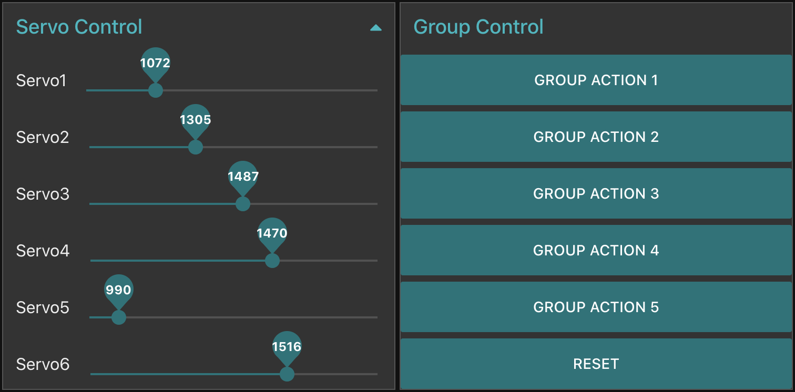

# DemoRobot
A simple demo to show how Pelion Edge can be used to control a 6 DoF robot arm. 

It primarily shows the Pelion Edge’s protocol translator capabilities. The robot arm in this demo is basically constructed with 6 servos, and there is a controller board which provides a serial communication programming interface and its relevant proprietary protocol. With Pelion Edge, we can easily implement a protocol translator using the [JSON-RPC API](https://www.pelion.com/docs/device-management-edge/2.0/developer-guide/json-rpc-api-for-protocol-translators.html), which maps each of the servo to a LwM2M resource, then all of them can be controlled from any mobile or web based applications remotely.  Within this demo, we also provide a [webpage](http://ec2-35-177-137-35.eu-west-2.compute.amazonaws.com:1880/ui) with Node-Red. From a mobile, you can open the link and use a slider to control the position of servos, and you can also send command (group action) to let the robot moves servos to target position at once.

# LwM2M Object Mapping

## Single Servo Control
Servo1 ---> /3337/0
Servo2 ---> /3337/1
Servo3 ---> /3337/2
Servo4 ---> /3337/3
Servo5 ---> /3337/4
Servo6 ---> /3337/5

For each servo, there are 2 resources - 
/3337/0/5536 identifies the current position of servo #1;
/3337/0/5537 identifies the transition time when the servo is to move to a new position;

## Group Action of Servos
The robot arm's control board supports execution of group actions, which is to move servos to target positions in a single command. I.E group action #1 moves several servos back and forth to complete a task of pick up an physical object and put it into a box. The specific position of servos and moving sequences are stored in the control board. A customized LwM2M object 10315 is defined to support this feature. /10315/0/7 is an executable resource that starts the execution of a group action that identified by an integer number. /10315/0/8 is an executable resource that stops the execution of current group action. 

# Screenshots

